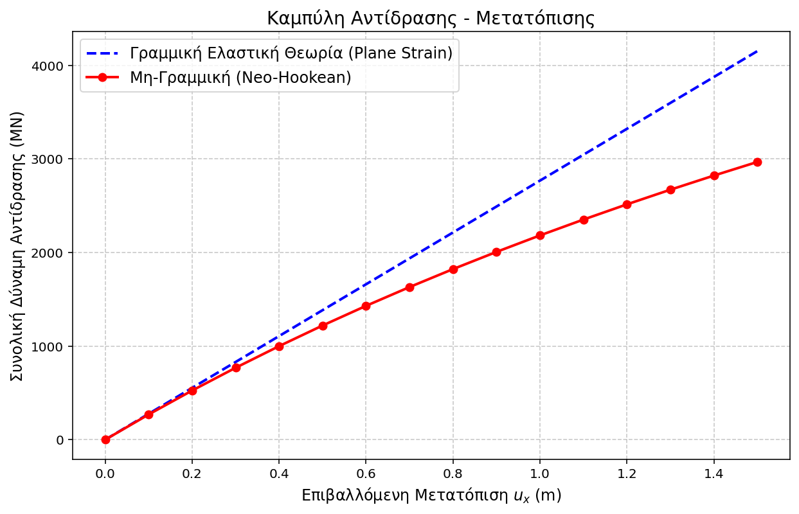
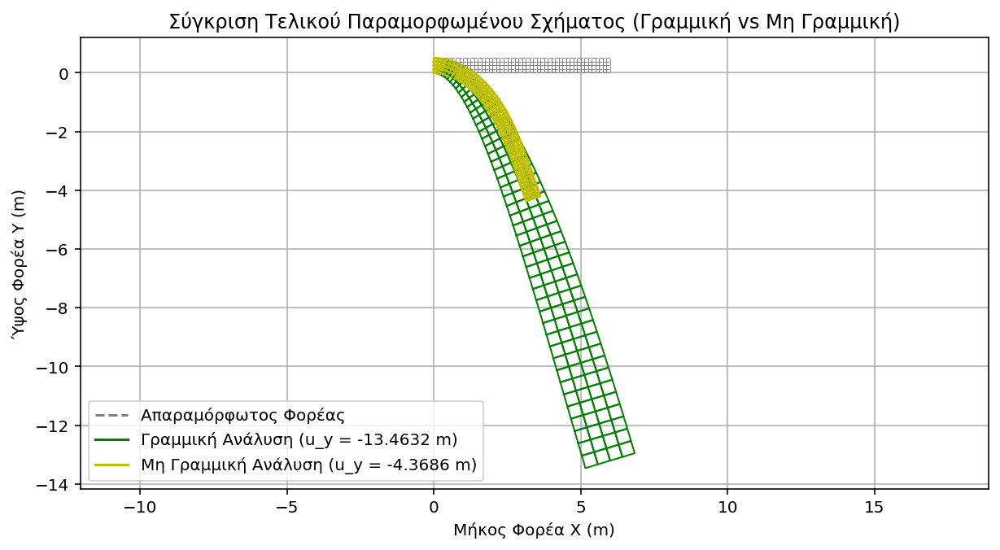

# Python Nonlinear FEA Solver (2D)

A custom, object-oriented Finite Element Analysis (FEA) solver written entirely in Python from scratch. This project is capable of handling **Geometric Nonlinearity** (Large Displacements) and **Material Nonlinearity** (Hyperelasticity), strictly validated against commercial computational mechanics software (e.g., ANSYS).

## 📌 Project Overview
While many engineers treat FEA software as a "black box", the development of accurate Digital Twins and Predictive models requires a deep understanding of the underlying computational physics. This solver was built to explicitly model complex nonlinear behaviors in 2D continuous structures.

The solver features **Isoparametric Quad4 elements**, a **Total Lagrangian** formulation for large deformations, and a robust **Newton-Raphson** iterative scheme for nonlinear equilibrium finding.

## 🚀 Key Implementations

* **Geometric Nonlinearity:** Handles large displacement kinematics using a Total Lagrangian approach, properly updating the deformation gradient and the nonlinear strain-displacement matrices ($B_{NL}$).
* **Hyperelastic Material Laws:** Beyond standard linear elasticity, the solver incorporates a **Neo-Hookean** material model. It analytically computes the 2nd Piola-Kirchhoff stress tensor and the tangent constitutive (material stiffness) matrix.
* **Nonlinear Solver:** A custom implementation of the Newton-Raphson method with displacement-control load-stepping and dynamic residual tolerance tracking.

## 📊 Validation & Results
The solver's accuracy (displacements, principal stresses, and reaction forces) was benchmarked and strictly validated. It demonstrates robust convergence and near-zero error margins even under massive mechanical deformations.

### Force-Displacement Curve (Validation)
The nonlinear response captures the stiffening/softening effects accurately under large strains.

### Large Deformations (Kinematics)
The solver flawlessly handles complex mesh distortions (Undeformed vs. Deformed states) using the Total Lagrangian framework.

## 🛠️ Tech Stack
* **Language:** Python
* **Mathematics & Matrices:** NumPy, SciPy (`scipy.linalg` for fast and stable linear algebra operations)
* **Visualization:** Matplotlib (for stress fields and reaction curves)

## 💻 Repository Structure
* `images/`: Validation plots and visualizations.
* `src/element_quad4.py`: Isoparametric shape functions, Jacobian mapping, and nonlinear B-matrix formulation.
* `src/materials.py`: Hyperelastic (Neo-Hookean) material class definitions and continuum mechanics invariants.
* `src/solver_nr.py`: The Newton-Raphson nonlinear equilibrium solver algorithm.
* `src/main.py`: Model assembly, boundary constraint application, and execution pipeline.
